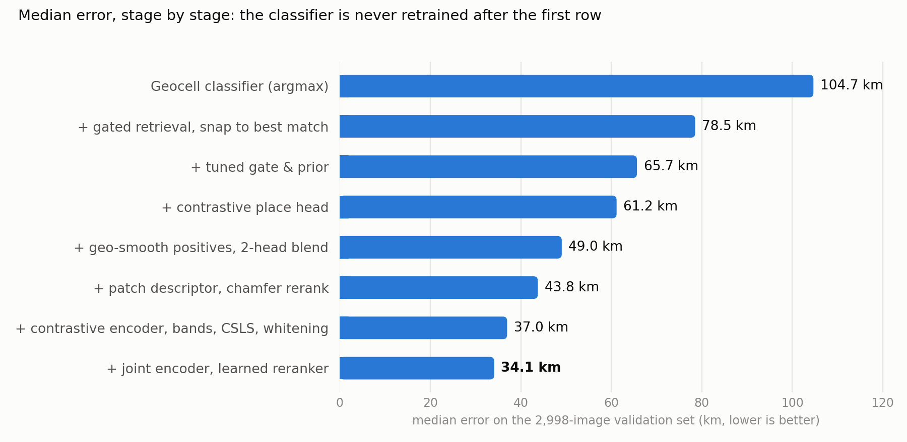
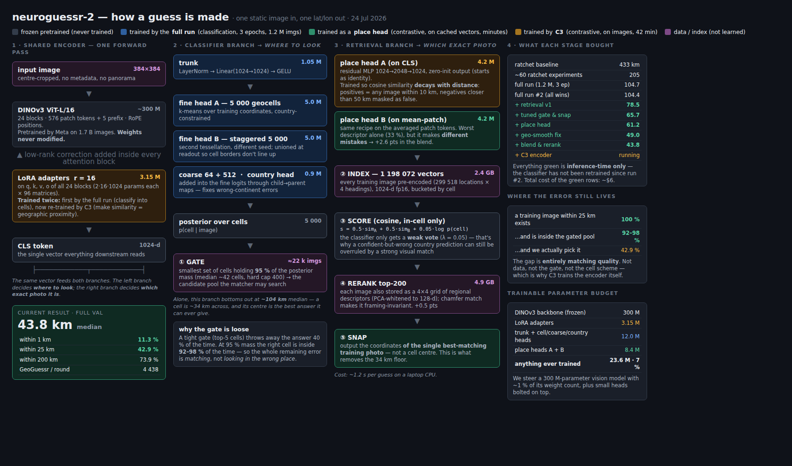

# NeuroGuessr 2

**Where on Earth was this photo taken?** One street-level photo goes in and one latitude/longitude
comes out. There is no panorama, compass heading or metadata. The model's median error is
**34.1 km** on a held-out set of 2,998 images from 123 countries, and the whole pipeline runs
offline on an Android phone.

[**Paper (PDF)**](paper/neuroguessr.pdf) · [**Android app**](https://github.com/bednarjosef/neuroguessr-app) ·
[Checkpoints & cached vectors](https://huggingface.co/josefbednar/neuroguessr-fullrun2-ckpt) ·
[Dataset](https://huggingface.co/datasets/josefbednar/streetview-acw-300k) ·
[v1 (194 km)](https://github.com/bednarjosef/neuroguessr)

<picture>
  <source media="(prefers-color-scheme: dark)" srcset="docs/progression-dark.png">
  
</picture>

## Results

All rows are on the same frozen 2,998-image validation split. No validation location appears in training.

| | median | within 1 km | within 25 km | GeoGuessr / round |
|---|---:|---:|---:|---:|
| NeuroGuessr v1 (CLIP ViT-L, full fine-tune, same data) | 194 km | – | – | 4140 |
| Geocell classifier only | 104.7 km | 0.0 % | 7.6 % | – |
| **Full pipeline** | **34.1 km** | 10.1 % | **46.3 %** | **4470** |
| On device, int8 index, 4 views per location (6.2 GB) | 33.9 km | – | 46.4 % | – |
| On device, int8 index, 1 view per location (1.6 GB) | 44.4 km | – | 43.0 % | – |

For orientation only (different test set): PIGEON reports 131 km from a single image and
44.4 km from a four-image panorama.

## How it works

A classifier narrows down where to look, and retrieval picks the exact photo.

1. **Encode.** A DINOv3 ViT-L/16 backbone with rank-16 LoRA adapters turns the photo into a single
   1024-d descriptor. The 300 M backbone weights stay frozen; about 28 M parameters are trained in total.
2. **Classify.** Heads on that descriptor produce a posterior over 5,000 learned geocells, with
   coarse and country-level heads folded in to cut wrong-continent errors.
3. **Gate.** The gate keeps the smallest set of cells that holds 95 % of the posterior, typically
   about 40 cells and about 20 k candidate images.
4. **Retrieve.** Candidates come from an index of all **1,198,072** training images. They are
   scored with a blend of contrastive "band" heads trained at 5/10/25/50 km, a PCA-whitened raw
   descriptor and CSLS hubness correction.
5. **Rerank and snap.** A 16-feature logistic reranker (17 parameters) reorders the top 100.
   The answer is the winning training photo's **real coordinates**, not a cell centre.

Architecture diagram (a snapshot from the 43.8 km stage)

## What I found

- **Geocell classifiers hit a quantization floor.** With 5,000 cells and an argmax readout, the
  median cannot go below about 34 km. Retrieval removes that floor because it returns a real
  coordinate. The single biggest gain (104.7 → 78.5 km) came from reusing features that were
  already computed as a retrieval index, with **no training at all**.
- **What remains is almost entirely a matching problem.** For 100 % of queries, a training
  image exists within 25 km. For 92–98 % of queries, such an image makes it through the gate.
  The matcher picks one only 46 % of the time.
- **Cheap work on cached vectors beat every encoder fine-tune.** Hubness correction, whitening,
  offline band heads and a 17-parameter reranker were together worth more than any backbone
  retraining, at roughly a thousandth of the cost. The whole retrieval stage cost about $6 of GPU time.
- **DINOv3 cannot use int8 on the phone.** A massive-activation channel (peak about 157 k) drops
  descriptor cosine similarity from 0.99 to 0.60 under int8 and overflows fp16. What ships
  instead is fp16 linear layers with fp32 norms and residual path. The *index*, by contrast,
  quantizes to int8 with no measurable loss.

The paper covers all of this in detail, including 35 rejected ideas.

## Limitations

- The model is trained and evaluated on **Street View** imagery. On consumer photos (IM2GPS3k)
  it reaches only 9.6 % within 25 km, against 34–37 % for systems trained on Flickr. The cause
  is domain shift in the descriptor, not index coverage (see [`benchmarks/`](benchmarks/)).
- The mean error is 328 km, because the model sometimes fails confidently on the wrong continent.
- Geolocating a single photo can be misused. About one photo in ten resolves to within 1 km.
  The paper's privacy section discusses this.

## Repository

| | |
|---|---|
| [`prepare.py`](prepare.py) | Frozen evaluation harness: data subset, splits, haversine, metric panel |
| [`train.py`](train.py), [`train_full.py`](train_full.py), [`train_c5.py`](train_c5.py) | Classifier training: 60 k-image search phase, full 1.2 M-image run, joint classifier + episode run |
| [`retrieval/`](retrieval/) | Index building, place and band heads, contrastive encoder fine-tunes (C3/C4), lever sweeps, reranker. [`local_evals/bench_eval.py`](retrieval/local_evals/bench_eval.py) is the end-to-end champion scorer |
| [`benchmarks/`](benchmarks/) | IM2GPS / IM2GPS3k manifests, provenance and results |
| [`paper/`](paper/) | LaTeX source and PDF |
| [`research/`](research/) | The full research record: log, experiment ledger, plans and run logs |
| [`vast.py`](vast.py) | Control plane for renting, running on and tearing down Vast.ai GPU boxes |
| [`webapp/`](webapp/) | Minimal local demo server (classifier readout) |

**Running it.** Run `uv sync` first. The DINOv3 backbone is gated on Hugging Face, so set `HF_TOKEN`.
Trained checkpoints, band heads and cached descriptor arrays are on
[Hugging Face](https://huggingface.co/josefbednar/neuroguessr-fullrun2-ckpt), with one folder per phase.
With those, every retrieval experiment runs on cached vectors without re-encoding a single image.
Training runs on rented GPUs. [`research/FULLRUN.md`](research/FULLRUN.md) is the runbook for the
full-corpus classifier run (about 2 h on 4× RTX 5090).

## How it was built

The experiments were proposed and run by an autonomous agent, under my supervision, on a keep-or-reset loop
forked from [karpathy/autoresearch](https://github.com/karpathy/autoresearch). The agent changes one
experiment file, runs it once against the frozen evaluator, and keeps the change only if the
median improves. Enforcement is structural: only the experiment file is ever uploaded to the GPU
box, so the evaluator cannot drift. [`research/`](research/) contains the whole record: all 74
logged runs with the rejections and crashes, the cross-session research log, and the plans.

## License

MIT, see [LICENSE](LICENSE). The keep-or-reset loop is adapted from
[karpathy/autoresearch](https://github.com/karpathy/autoresearch) (MIT).
